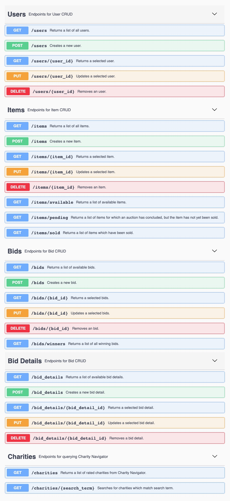

# Auctionable Change API [](https://travis-ci.com/Auctionable-Change/auctionable_change_api)

## Description

**Auctionable Change API** is the backend API for our [Turing School of Software and Design](https://turing.io/) capstone project, **Auctionable Change**.

The idea behind **A.change** is to create a platform in which an individual can donate to charity even when funds are low. A **seller** can post an item for silent auction, set its minimum bid price, then select a charity to which the funds from that item's auction would be donated. A **bidder** can select an item and enter a competitive amount greater than the minimum bid. After the auction time frame has closed, the **winning** bidder is directed to place a donation at the proper charity, upload proof and send shipping details to the seller so they may receive the item.

All **users** must register and login to sell or bid, keeping records of past and current bids. 

This **API** functions to consume a charity listing/ranking API and return that information to the front end, as well as provide full endpoints for creating, maintaining and accessing information within the database.

## Endpoints

Try It!: [Swagger Endpoint Diagrams](https://auctionable-change-api.herokuapp.com/swagger)




## Application Links

BE Production: https://auctionable-change-api.herokuapp.com/


FE Repo: https://github.com/Auctionable-Change/auctionable_change  

## Local Setup Instructions
#### Python and Flask Setup

- Clone this repo to your local machine using SSH:
  ```
  git clone git@github.com:Auctionable-Change/auctionable_change_api.git
  ```
- Navigate to the new directory:
  ```
  cd auctionable_change_api
  ```
- Set up virtual environment
  ```
  python3 -m venv venv
  . venv/bin/activate
  ```
- Install Flask (if necessary)
  ```
  pip install Flask
  ```
- Install packages in requirements.txt:
  ```
  pip install -r requirements.txt
  ```
- Set environment variables (place in an `.env` file at the root level)
  ```
  APP_SETTINGS="development"
  DATABASE_URL="postgresql://localhost/auctionable_change_api"
  FLASK_APP=app
  CHARITY_APP_ID=<register for your own>
  CHARITY_APP_KEY=<register for your own>
  TOKEN_SECRET_KEY=\xc4h\xb1\x8b\xcf.\rd`v\x06\xfdrb'\xcd\r\xf9\x84a\xa0\xb9$>
  ```

#### Database Setup


- Run the Alembic migrations to add tables to database:
  ```
  python manage.py db upgrade
  python manage.py db migrate
  ```

#### Starting Flask Server

- To run server on `localhost:5000/`:
  ```
  python run.py
  ```

## Testing and Coverage
- To run a testing and coverage report utilizing the included `coverage` module:
  ```
  nosetests --cover-package=application --with-coverage
  ```

## Dev Team BE

 - Stephanie Friend ([GitHub](https://github.com/StephanieFriend), [LinkedIn](https://www.linkedin.com/in/s-friend/))
 - Kevin McGrevey ([GitHub](https://github.com/kmcgrevey), [LinkedIn](www.linkedin.com/in/‎kevinmcgrevey‎/))
 - Andrew Reid ([GitHub](https://github.com/reid-andrew), [LinkedIn](https://www.linkedin.com/in/reida/))

 ## Technologies and Frameworks

- Back-End
  - Language: Python 3.8.4
  - Framework: Flask 1.1.2
  - Testing: Nose
  - Database: PostgreSQL
  - Database Interaction & ORM: SQLAlchemy
  - Database Migrations: Alembic (via Flask-Migration wrapper)
  - API management: Flask-RESTful, Requests
- CI/CD
  - Continuous Integration: TravisCI
  - Deployment: Heroku
- Project Management
  - Kanban & Sprint Planning: Github Project Boards
  - Agile Planning & Retros: Miro
  - Communication: Zoom, Slack, Tuple
